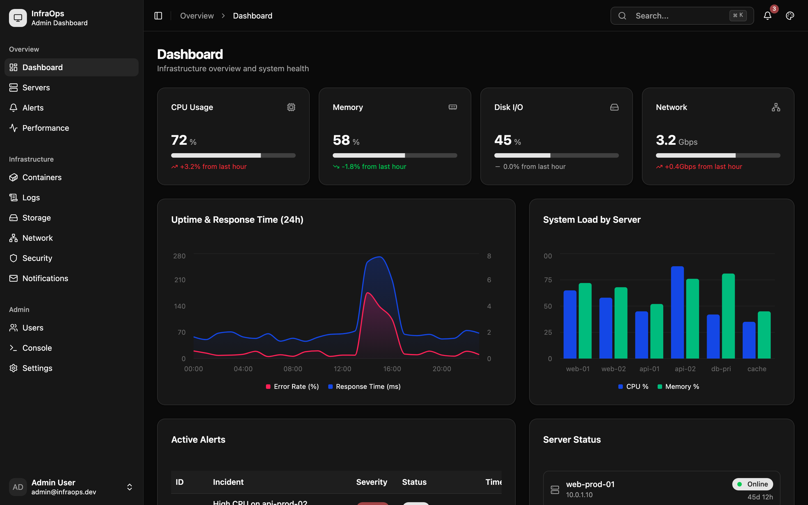
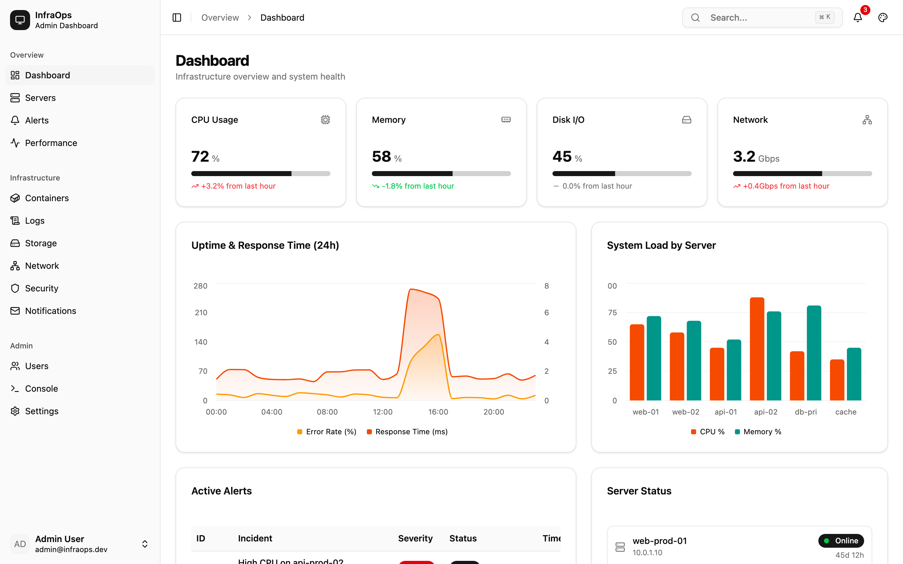
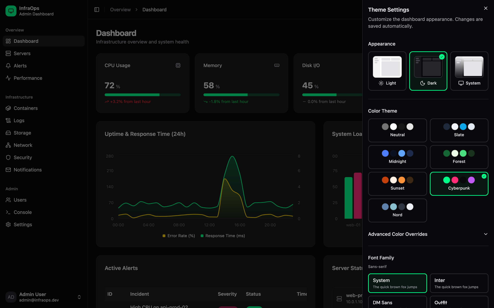
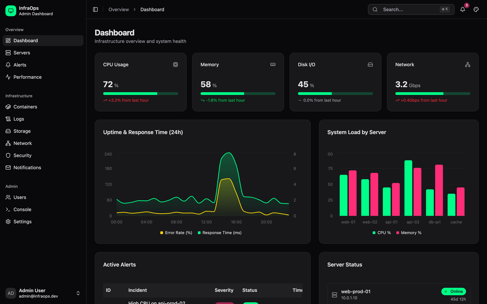
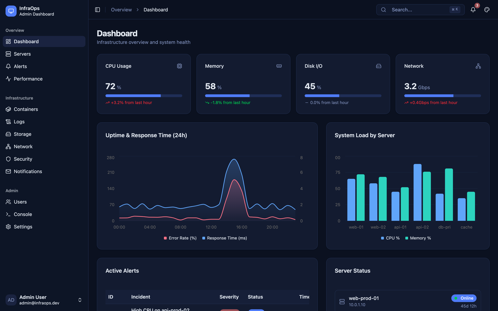
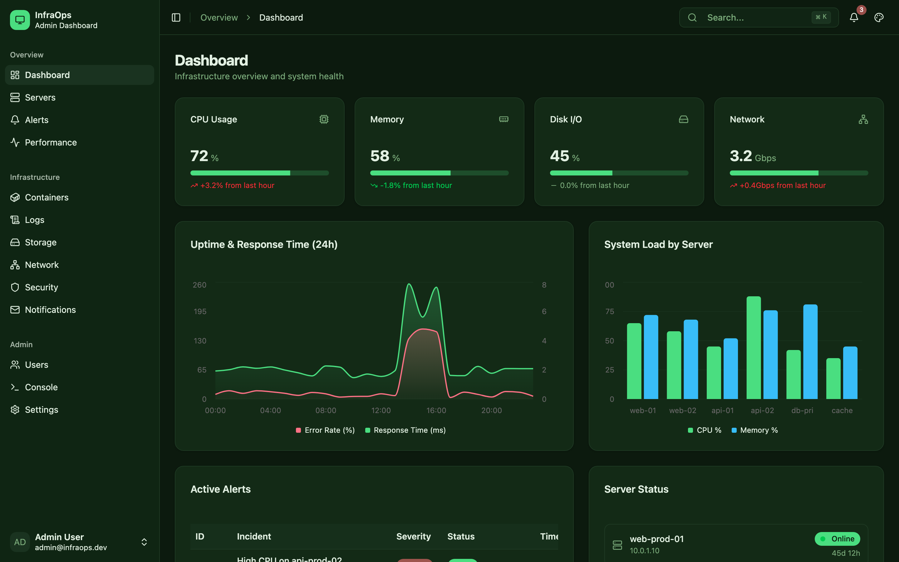
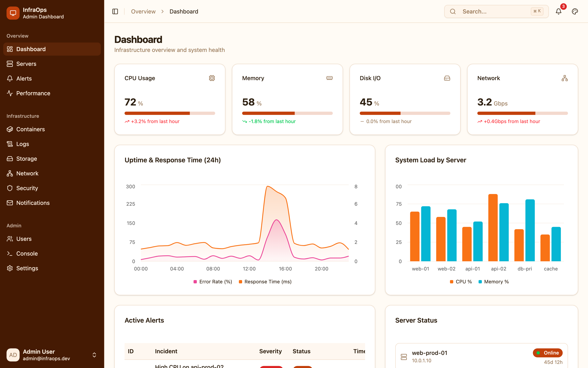
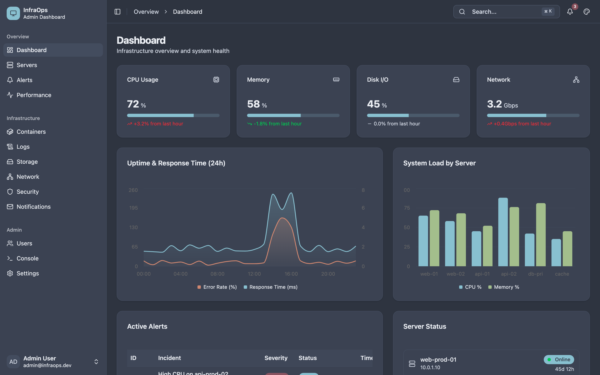

# shadcn-dash-lab

**A batteries-included dashboard starter for people who are tired of unstyled boilerplate.**

Spin up a polished DevOps-style dashboard in seconds — then customize every pixel of it. Ships with 7 color themes, light/dark mode, adjustable density & typography, interactive charts, virtualized logs, a command palette, and a live theme editor so you can dial in exactly the look you want before carrying the patterns into your own app.

### Why this exists

Most shadcn/ui starters give you a blank canvas. This one gives you a *finished room* — KPI cards, server grids, uptime charts, alert tables, log explorer — so you can see how the pieces fit together at scale and rip out what you don't need.

## Screenshots

| Dark (default) | Light |
|:-:|:-:|
|  |  |

### Switch themes on the fly

Open the built-in theme customizer to swap color presets, toggle light/dark, change fonts, adjust density, and more — all persisted to localStorage.



### 7 built-in color presets

| Cyberpunk | Midnight | Forest |
|:-:|:-:|:-:|
|  |  |  |

| Sunset | Nord | |
|:-:|:-:|:-:|
|  |  | |

## Prerequisites

- [Node.js](https://nodejs.org/) v18 or later
- npm (comes with Node.js)

## Getting Started

```bash
# Install dependencies
npm install

# Start the dev server with hot reload
npm run dev
```

The app will be available at `http://localhost:5173`.

## Building

```bash
# Type-check and build for production
npm run build

# Preview the production build locally
npm run preview
```

## License

[MIT](LICENSE)
